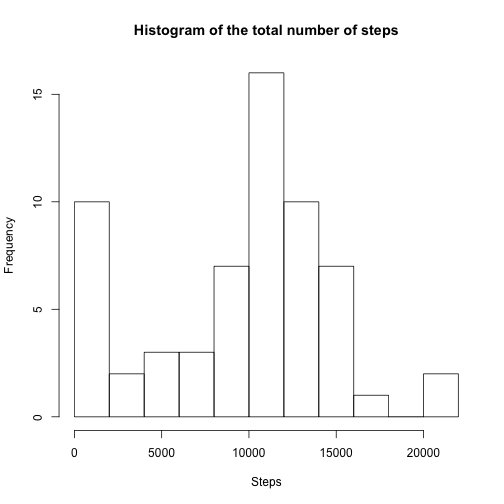
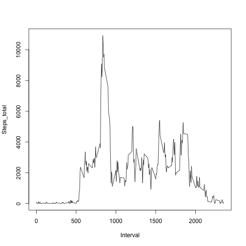
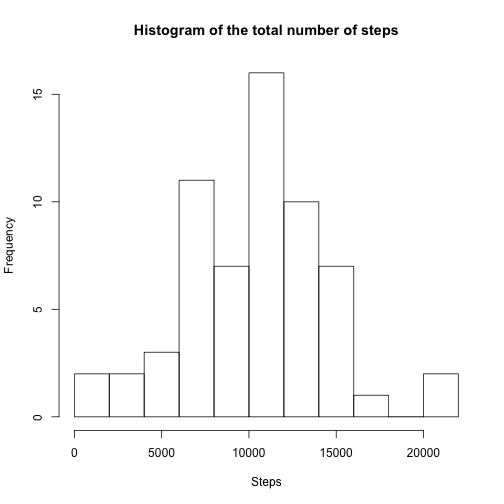
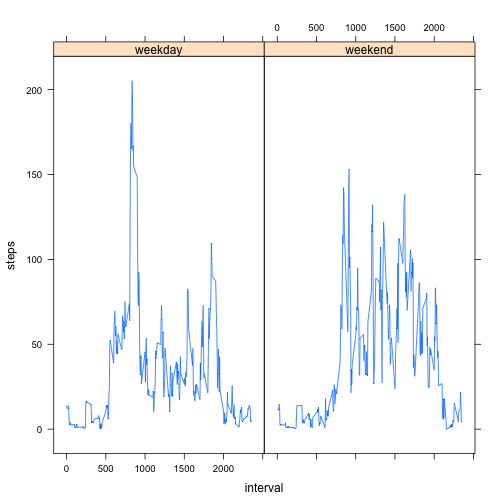

#Peer Assessment 1

Loading and transforming the data


```r
act <- read.csv("activity.csv")
act$date<-as.factor(act$date)
head(act)
```

```
##   steps       date interval
## 1    NA 2012-10-01        0
## 2    NA 2012-10-01        5
## 3    NA 2012-10-01       10
## 4    NA 2012-10-01       15
## 5    NA 2012-10-01       20
## 6    NA 2012-10-01       25
```

Histogram of the total number of steps per day:


```r
new_act<-act[order(act$date),]
b<-split(new_act,new_act$date)
res<-sapply(b,function(elt) sum(elt[,1], na.rm=TRUE))
hist(res,main = "Histogram of the total number of steps", xlab="Steps", breaks=15)
```

 

Mean and median of the total number of steps per day:


```r
x<-unique(new_act$date)
means<-sapply(b,function(elt) mean(elt[,1], na.rm=TRUE))
medians<-sapply(b,function(elt) median(elt[,1], na.rm=TRUE))
result1<-data.frame(x,means,medians)
names(result1) <- c("Date", "Mean of steps", "Median of steps")
print(result1)
```

```
##                  Date Mean of steps Median of steps
## 2012-10-01 2012-10-01           NaN              NA
## 2012-10-02 2012-10-02     0.4375000               0
## 2012-10-03 2012-10-03    39.4166667               0
## 2012-10-04 2012-10-04    42.0694444               0
## 2012-10-05 2012-10-05    46.1597222               0
## 2012-10-06 2012-10-06    53.5416667               0
## 2012-10-07 2012-10-07    38.2465278               0
## 2012-10-08 2012-10-08           NaN              NA
## 2012-10-09 2012-10-09    44.4826389               0
## 2012-10-10 2012-10-10    34.3750000               0
## 2012-10-11 2012-10-11    35.7777778               0
## 2012-10-12 2012-10-12    60.3541667               0
## 2012-10-13 2012-10-13    43.1458333               0
## 2012-10-14 2012-10-14    52.4236111               0
## 2012-10-15 2012-10-15    35.2048611               0
## 2012-10-16 2012-10-16    52.3750000               0
## 2012-10-17 2012-10-17    46.7083333               0
## 2012-10-18 2012-10-18    34.9166667               0
## 2012-10-19 2012-10-19    41.0729167               0
## 2012-10-20 2012-10-20    36.0937500               0
## 2012-10-21 2012-10-21    30.6284722               0
## 2012-10-22 2012-10-22    46.7361111               0
## 2012-10-23 2012-10-23    30.9652778               0
## 2012-10-24 2012-10-24    29.0104167               0
## 2012-10-25 2012-10-25     8.6527778               0
## 2012-10-26 2012-10-26    23.5347222               0
## 2012-10-27 2012-10-27    35.1354167               0
## 2012-10-28 2012-10-28    39.7847222               0
## 2012-10-29 2012-10-29    17.4236111               0
## 2012-10-30 2012-10-30    34.0937500               0
## 2012-10-31 2012-10-31    53.5208333               0
## 2012-11-01 2012-11-01           NaN              NA
## 2012-11-02 2012-11-02    36.8055556               0
## 2012-11-03 2012-11-03    36.7048611               0
## 2012-11-04 2012-11-04           NaN              NA
## 2012-11-05 2012-11-05    36.2465278               0
## 2012-11-06 2012-11-06    28.9375000               0
## 2012-11-07 2012-11-07    44.7326389               0
## 2012-11-08 2012-11-08    11.1770833               0
## 2012-11-09 2012-11-09           NaN              NA
## 2012-11-10 2012-11-10           NaN              NA
## 2012-11-11 2012-11-11    43.7777778               0
## 2012-11-12 2012-11-12    37.3784722               0
## 2012-11-13 2012-11-13    25.4722222               0
## 2012-11-14 2012-11-14           NaN              NA
## 2012-11-15 2012-11-15     0.1423611               0
## 2012-11-16 2012-11-16    18.8923611               0
## 2012-11-17 2012-11-17    49.7881944               0
## 2012-11-18 2012-11-18    52.4652778               0
## 2012-11-19 2012-11-19    30.6979167               0
## 2012-11-20 2012-11-20    15.5277778               0
## 2012-11-21 2012-11-21    44.3993056               0
## 2012-11-22 2012-11-22    70.9270833               0
## 2012-11-23 2012-11-23    73.5902778               0
## 2012-11-24 2012-11-24    50.2708333               0
## 2012-11-25 2012-11-25    41.0902778               0
## 2012-11-26 2012-11-26    38.7569444               0
## 2012-11-27 2012-11-27    47.3819444               0
## 2012-11-28 2012-11-28    35.3576389               0
## 2012-11-29 2012-11-29    24.4687500               0
## 2012-11-30 2012-11-30           NaN              NA
```


Plot of the 5-minute interval (x-axis) and the average number of steps taken, averaged across all days (y-axis)


```r
new_act<-act[order(act$interval),]
b<-split(new_act,new_act$interval)
res<-sapply(b,function(elt) sum(elt[,1], na.rm=TRUE))
x<-unique(new_act$interval)
result<-data.frame(x,res)
names(result)<-c("Interval", "Steps_total")
with(result, plot(Interval, Steps_total, type = "l"))
```

 

Interval containig the maximum number of steps:


```r
result[(result$Steps==max(result$Steps_total, na.rm = TRUE)),]
```

```
##     Interval Steps_total
## 835      835       10927
```

In this dataset there are 2304 rows with missing values:


```r
sum(is.na(act$steps))
```

```
## [1] 2304
```


Filling in all of the missing values in the dataset (mean for this 5-minute interval).


```r
tmp_act<-act
m <- merge(tmp_act, result, by.x = "interval", by.y = "Interval")
t<-m$steps
bad<-is.na(t)
t2<-m$Steps_total
t2<-t2[!bad]
t[is.na(t)]<-t2
```

```
## Warning in t[is.na(t)] <- t2: число единиц для замены не является
## произведением длины замены
```

```r
m$steps<-t
summary(m)
```

```
##     interval          steps                date        Steps_total     
##  Min.   :   0.0   Min.   :  0.00   2012-10-01:  288   Min.   :    0.0  
##  1st Qu.: 588.8   1st Qu.:  0.00   2012-10-02:  288   1st Qu.:  131.8  
##  Median :1177.5   Median :  0.00   2012-10-03:  288   Median : 1808.0  
##  Mean   :1177.5   Mean   : 35.67   2012-10-04:  288   Mean   : 1981.3  
##  3rd Qu.:1766.2   3rd Qu.: 18.00   2012-10-05:  288   3rd Qu.: 2800.2  
##  Max.   :2355.0   Max.   :806.00   2012-10-06:  288   Max.   :10927.0  
##                                    (Other)   :15840
```


Histogram and table with means and medians for new dataset:


```r
new_act<-m[order(m$date),]
b<-split(new_act,new_act$date)
res<-sapply(b,function(elt) sum(elt[,2], na.rm=TRUE))
hist(res,main = "Histogram of the total number of steps", xlab="Steps", breaks=15)
```

 

```r
x<-unique(new_act$date)
means<-sapply(b,function(elt) mean(elt[,2], na.rm=TRUE))
medians<-sapply(b,function(elt) median(elt[,2], na.rm=TRUE))
result1<-data.frame(x,means,medians)
names(result1) <- c("Date", "Mean of steps", "Median of steps")
print(result1)
```

```
##                  Date Mean of steps Median of steps
## 2012-10-01 2012-10-01    24.6944444              10
## 2012-10-02 2012-10-02     0.4375000               0
## 2012-10-03 2012-10-03    39.4166667               0
## 2012-10-04 2012-10-04    42.0694444               0
## 2012-10-05 2012-10-05    46.1597222               0
## 2012-10-06 2012-10-06    53.5416667               0
## 2012-10-07 2012-10-07    38.2465278               0
## 2012-10-08 2012-10-08    24.8854167               9
## 2012-10-09 2012-10-09    44.4826389               0
## 2012-10-10 2012-10-10    34.3750000               0
## 2012-10-11 2012-10-11    35.7777778               0
## 2012-10-12 2012-10-12    60.3541667               0
## 2012-10-13 2012-10-13    43.1458333               0
## 2012-10-14 2012-10-14    52.4236111               0
## 2012-10-15 2012-10-15    35.2048611               0
## 2012-10-16 2012-10-16    52.3750000               0
## 2012-10-17 2012-10-17    46.7083333               0
## 2012-10-18 2012-10-18    34.9166667               0
## 2012-10-19 2012-10-19    41.0729167               0
## 2012-10-20 2012-10-20    36.0937500               0
## 2012-10-21 2012-10-21    30.6284722               0
## 2012-10-22 2012-10-22    46.7361111               0
## 2012-10-23 2012-10-23    30.9652778               0
## 2012-10-24 2012-10-24    29.0104167               0
## 2012-10-25 2012-10-25     8.6527778               0
## 2012-10-26 2012-10-26    23.5347222               0
## 2012-10-27 2012-10-27    35.1354167               0
## 2012-10-28 2012-10-28    39.7847222               0
## 2012-10-29 2012-10-29    17.4236111               0
## 2012-10-30 2012-10-30    34.0937500               0
## 2012-10-31 2012-10-31    53.5208333               0
## 2012-11-01 2012-11-01    23.9479167               9
## 2012-11-02 2012-11-02    36.8055556               0
## 2012-11-03 2012-11-03    36.7048611               0
## 2012-11-04 2012-11-04    24.4652778               9
## 2012-11-05 2012-11-05    36.2465278               0
## 2012-11-06 2012-11-06    28.9375000               0
## 2012-11-07 2012-11-07    44.7326389               0
## 2012-11-08 2012-11-08    11.1770833               0
## 2012-11-09 2012-11-09    23.8333333               9
## 2012-11-10 2012-11-10    23.9097222               9
## 2012-11-11 2012-11-11    43.7777778               0
## 2012-11-12 2012-11-12    37.3784722               0
## 2012-11-13 2012-11-13    25.4722222               0
## 2012-11-14 2012-11-14    24.2847222              10
## 2012-11-15 2012-11-15     0.1423611               0
## 2012-11-16 2012-11-16    18.8923611               0
## 2012-11-17 2012-11-17    49.7881944               0
## 2012-11-18 2012-11-18    52.4652778               0
## 2012-11-19 2012-11-19    30.6979167               0
## 2012-11-20 2012-11-20    15.5277778               0
## 2012-11-21 2012-11-21    44.3993056               0
## 2012-11-22 2012-11-22    70.9270833               0
## 2012-11-23 2012-11-23    73.5902778               0
## 2012-11-24 2012-11-24    50.2708333               0
## 2012-11-25 2012-11-25    41.0902778               0
## 2012-11-26 2012-11-26    38.7569444               0
## 2012-11-27 2012-11-27    47.3819444               0
## 2012-11-28 2012-11-28    35.3576389               0
## 2012-11-29 2012-11-29    24.4687500               0
## 2012-11-30 2012-11-30    24.4270833               9
```


As you can see histogram differs from the estimates in the 1st part. Mean's and median's values are practically the same. 
It's because of the fact that the total number of daily steps increase, but mean and median for each 5-minute interval stay the same.

We need to add column "weekday" to new dataset and make the plot with library lattice:


```r
d<-as.POSIXlt(m$date)
m$weekday<-rep(0,nrow(m))
m$weekday[d$wday==0 | d$wday==6]<-"weekend"
m$weekday[m$weekday != "weekend"]<-"weekday"
m$weekday<-as.factor(m$weekday)
library(lattice)
m_wday<-m[(m$weekday=="weekday"),]
m_wend<-m[(m$weekday=="weekend"),]
b<-split(m_wday,m_wday$interval)
c<-split(m_wend,m_wend$interval)
res_wday<-sapply(b,function(elt) mean(elt[,2]))
res_wend<-sapply(c,function(elt) mean(elt[,2]))
x<-unique(m_wday$interval)
y<-unique(m_wend$interval)
wday<-data.frame(x,res_wday,rep("weekday",length(x)))
wend<-data.frame(y,res_wend,rep("weekend",length(y)))
names(wday)<-c("interval","steps", "weekday")
names(wend)<-c("interval","steps", "weekday")
new_act<-rbind(wday,wend)
xyplot(steps~interval|weekday,new_act, type="l")
```

 

